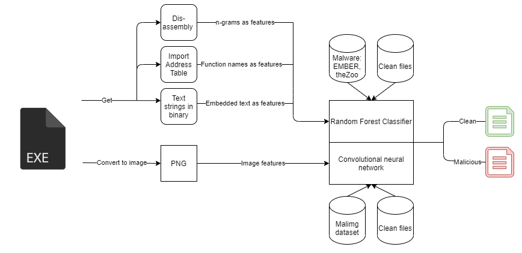

# Malware classification with machine learning

Traditionally antivirus software compare hash signatures to malware databases to verify if suspected executables are malicious. Malware variants that use packing or obfuscating techniques can circumvent this verification easily. Data analysis and machine learning methods can be used to analyze executable files and provide detection on malware variants also. 

A 2020 research survey describes different methods that could be utilized in [The rise of machine learning for detection and classification of malware: Research developments, trends and challenges](https://www.sciencedirect.com/science/article/pii/S1084804519303868). The paper provides a good overview of malware detection algorithms, ways to extract features from executable files and datasets to evaluate classification on. Features that can be extracted from executable files are divided into two categories: static and dynamic. Feature engineering, a practice where domain expertise is used to extract relevant features from raw data, plays an important role in creating a capable malware classifying machine learning model. 

### Static features

A number of features can be gathered from the file without it being run, making static analysis quick and risk-free. Executable files in Windows for example have PE headers, where fields such as Import Address Table (IAT) can be useful in determining if the file is malicious. The research survey lists other features that can be extracted using static methods:
* Searching for all the text inside the executable, which could reveal file paths or IP addresses that the file will use. This is a simple method and can be performed with for example by Linux command "strings". 
* List all the imported functions to gain insight into the functionality of the file. [An open source tool Dependencies](https://github.com/lucasg/Dependencies) can be used to extract the imported functions.
* Analyzing headers and sections of the PE file. [Malwarebytes blog post lists five PE analysis tools here.](https://blog.malwarebytes.com/threat-analysis/2014/05/five-pe-analysis-tools-worth-looking-at/)
* PE file ".text" - sections can have encrypted code in them, that is decrypted during runtime using a decryption stub. The amount of encrypted code segments and sections labeled as ".stub" could be indication of malware.
* Disassembling the program and performing automated analysis on the assembly code. [Xori is an open souurce automation-ready disassembly tool, requires installation of Rust.](https://github.com/endgameinc/xori)

### Dynamic features

Dynamic features are gathered when the file is executed in a secure sandbox environment, enabling the analysis of function calls, network traffic or file system modifications that the file performs. Extracting features from sandbox is time and resource consuming compared to static analysis. Some malware are able to detect sandbox environments or are coded to delay it's malicious actions for days after execution, making them seem benign with quick analysis. 

[Cuckoo Sandbox](https://cuckoosandbox.org/) is an open source automated malware analysis system which generates reports from executed files. The sandbox can simulate realistic Android, Linux, macOS and Windows operating system environments.

# Creating a malware detection system

### Gather data

First thing needed is a directory with clean Portable Executable (PE) samples, and malware PE samples.

1. Clean PE samples can be acquired for example, from a personal Windows computer.
2. Malware PE samples can be acquired online for example, from VirusShare or theZoo GitHub repository.
	* https://virusshare.com/
	* https://github.com/ytisf/theZoo
	
### Create dataset from gathered data

When samples of clean and malware PE samples have been downloaded, a dataset to train the classifier needs to be created. Static features according to the picture below  can be extracted from the PE file.

The n-grams, function names and embedded text are extracted into columns for a dataset where one row is one PE file sample. Some research has also used a method where images are created from executable files, and the image is used as a feature to analyze whether the file is malicious or not. One such dataset is the [MalImg dataset](https://vision.ece.ucsb.edu/abstract/563). 

### Training a model from the created dataset

Machine learning models, such as a random forest classifier, can be trained using the PE file dataset. The random forest algorithm also provides insight into what features are most useful in classifying a file into clean or malware sample. Neural networks can create a classifier from large amounts of features and possibly one with better accuracy, but the system requires more processing power and data than training machine learning algorithms.

### Example open source system

[Malware Classification using classical Machine Learning and Deep Learning repository](https://github.com/pratikpv/malware_detect2) provides an example implementation, where PE file features are extracted to train multiple different machine learning algorithms to detect malicious files. Deep learning is also utilized by converting binaries to grayscale images and training neural networks, such as convolutional neural networks, with the images. The project utilizes Python and it's machine learning libraries Scikit-learn and PyTorch. The researches using the system gained on average 92% classification accuracy on best neural network models, though on some malware families the accuracy drops to 64%. 
