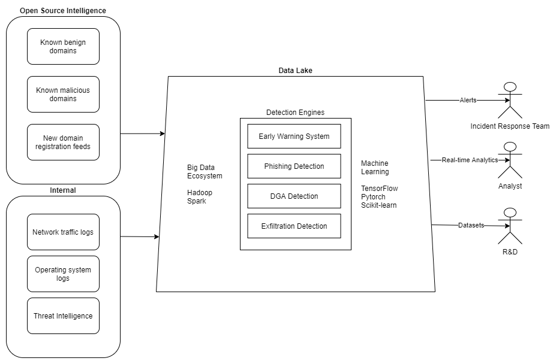

# AI in Cybersecurity

AI is the usage of machine learning algorithms or deep learning neural networks to automate tasks, predict future values or classify events using previous data or data from other sources. An AI is taught using training data, which in supervised learning needs labeled samples. A labeled sample for example could be an HTTP connection that would be labeled either 'malicious' or 'benign'. Then in the ideal case an AI would learn to distinguish between malicious and benign connections. 

In practice, creating labeled data is a tedious and lenghty process, thus an AI can be taught with unsupervised learning. In unsupervised learning, no labels for the data is needed. In the previous example, the AI would be given a large amount of HTTP connections as an dataset, and it would be tasked to create a presentation of a benign HTTP connection, so when the AI is trained, the malicious HTTP connections it sees do not fit the presentation of a HTTP connection it has learned and it raises an alert. 

Creating a well-performing neural network requires large amounts of data, usually at least a gigabyte large dataset, but machine learning algorithms can usually perform well in smaller datasets. The implementation of either a neural network or an algorithm is always dependent on the use case. AI systems also need to be tested thoroughly before using them in production using a test dataset that would contain similar data present in production environment. An anomaly detection model raising false alarms every minute would quickly cause alarm fatigue among administrators, and when a real alarm comes by, it could be ignored.

If the amount of data is too large to be processed at once or the data is gs gathered in a stream, one useful subset of machine learning called online learning or incremental learning could be utilized. In this type of learning, the AI is trained first with a small sample of network flow for example. As new traffic flow data is gathered, the AI is trained in small increments from the streaming data. The article [Incremental Machine Learning by Example: Detecting Suspicious Activity with Zeek Data Streams, River, and JA3 Hashes](https://research.nccgroup.com/2021/06/14/incremental-machine-leaning-by-example-detecting-suspicious-activity-with-zeek-data-streams-river-and-ja3-hashes/) provides a look of how to implement online learning for novelty detection and outlier detection.

AI tools and frameworks are commonly available as open source software or software-as-a-service (SaaS) in cloud platforms, such as Amazon Web Services, Azure or Google Cloud Platform. Some SaaS tools provide machine learning with minimal training, where pre-trained models created by the platform are used to enhance learning. Continous usage of the frameworks causes a larger cloud infrastructure bill, especially in use cases where large amounts of data need to be processed with large neural networks requiring huge amounts of computing power. 

### Applications of AI in Cybersecurity

**Creating a Cyber Data Lake**

Papers such as [An AI-based, Multi-stage detection system of banking botnets](https://arxiv.org/pdf/1907.08276.pdf) suggests creating a Cyber Data Lake - a data platform where external and internal data sources are congregated using Big Data tools. External data sources would include open source threat intelligence feeds, such as lists of malicious/phishing domains. The data platform can contain machine learning models, which use the inputs from data sources to create predictions or raise alarms. The data lake would be useful for security teams as a centralized platform to gather and record information. As a centralized platform, the data lake would serve multiple uses, like real-time analytics, datasets for research and development or data monetization.

**Automated Machine Learning**

Training skillful machine learning models requires knowledge about algorithms and feature engineering methods. These can however be automated with some frameworks, such as [the Neural Network Intelligence toolkit](https://github.com/microsoft/nni). These automate the feature engineering process and choose an optimal model for the data. 

**Anomaly Detection**

Currently the most applicable methods of AI in cybersecurity would be anomaly detection using either machine learning algorithms or deep learning neural networks. The anomaly detection would most likely be applied to detect anomalies from logs, these logs could be system logs or network traffic logs. More about anomaly detection in the repository [Anomaly Detection with Deep Learning](../../Data%20Collection/Anomaly%20Detection). Other potential methods are listed below

Anomaly detection methods could also be applied to command and control detection. When a malware has breached the network, it usually communicates to some server for further instructions. These communications can be well masked, but different from normal web traffic. A anomaly detection model that has learned the usual traffic of a network has the potential to spot these command and control connections, thus alerting the organization that an intrusion has occurred.

**Malware Detection**

Machine learning models have been used to detect malware. Usually malware detection is signature-based, where the problem is that if the malware signature is not in the signature database, it cannot be identified. Machine learning detectors can detect malware by analyzing the program's system calls for example. The downside is that the likelihood of false positives is much greater than in signature-based systems. 

Features for malware detection can be gathered from static or dynamic approaches. In static approaches, the binary content and metadata of the file, such as PE files, are analyzed. 

One example of a machine learning malware classifier using a static approach is [STAMINA](https://www.intel.com/content/www/us/en/artificial-intelligence/documents/stamina-deep-learning-for-malware-protection-whitepaper.html), which creates an image from the program's binary code and utilizes transfer learning to enhance prediction accuracy.

In a dynamic approach, the suspicious file is executed, and it's actions during runtime are analyzed. This includes system call traces, what registries the program modifies and what network traffic is generated by the program.

**User Behavior Analytics**

In order to detect unusual network traffic or operating system functionality, user behavior analytics could be used to construct user profiles from network flow and operating system log data. These require network and host specific modification and can't be generally implemented between organizations. When a user profile is constructed, other network traffic and system events could generate an alert, which would detect an insider threat. The downside is that not all anomalous events are malicious, some could be employees using new devices or testing new tools. As such, this is best suited for environments with mostly predictable user actions.

**Natural Language Models**

OpenAI's GPT-3 language model shows potential to be a useful tool in the future of cybersecurity. Currently the model is available by requesting beta access and in the future a subscription model will be implemented. The model was created by scraping the internet for text and training an extremely large neural network (175 billion parameters, ten times more large than previous GPT-2 model). The GPT-3 is a "few-shot" model, which means that the model must be "primed" with a couple of inputs in order to get a desired output. 

GPT-3 model could be useful for all things that require text generation or code generation. For example, if a security engineer wanted to create new firewall rules, he could describe them in english, such as "DDoS protection and limited ssh logins" and the model would generate a configuration file or a set of rules. Similar applications have already been made with GPT-3, for example JavaScript code is generated by describing the button that the designer needs or even creating a whole HTML page by again describing the contents.

### Threats against AI

A report by ENISA called [Artificial Intelligence Cybersecurity Challenges](https://www.enisa.europa.eu/publications/artificial-intelligence-cybersecurity-challenges) provides good insight into the lifecycle of an AI system and what threats to the system are present at each phase.

### Training

Due to the largest machine learning frameworks, such as Tensorflow, Pytorch and Scikit-learn being open source, machine learning and usage of frameworks can be easily self-taught or by courses, without having to pay for expensive licenses. Python is the most common programming language currently in the field. 

### List of AI-enhanced security tools

Below is a list of commercial AI-enabled security tools and services. Most of the tools are integrated on popular cloud services, such as on AWS or Azure. 

**Amazon Web Services**

* [Using Amazon GuardDuty to protect your S3 buckets](https://aws.amazon.com/blogs/aws/new-using-amazon-guardduty-to-protect-your-s3-buckets/) - monitors AWS account, workload and data activity in Amazon S3, raises alerts in case suspicious activity is detected.
* [Classifying sensitive data with Amazon Macie](https://aws.amazon.com/blogs/aws/new-enhanced-amazon-macie-now-available/) - Amazon Macie classifies data in S3 buckets either automatically or with user-defined regular expressions.

**Azure / Defender**

* [Defender Advanced Threat Protection](https://docs.microsoft.com/en-us/windows/security/threat-protection/microsoft-defender-atp/microsoft-defender-advanced-threat-protection) - Endpoint detection and reponse, behavioral blocking and containment, automated investigation and response, advanced threat hunting with analytics. 
* [Azure Sentinel, a modern SIEM in the cloud](https://azure.microsoft.com/en-us/blog/azure-sentinel-general-availability-a-modern-siem-reimagined-in-the-cloud/) - Visualize data with workbooks and apply built-in machine learning algorithms for anomaly detection. Easier threat hunting with collection of hunting queries and Jupyter Notebooks.

**CrowdStrike**

* [CrowdStrike Falcon - Machine Learning scanner](https://go.technicalcommunities.com/webdata/pdf/CrowdStrike-The-Rise-of-Machine-Learning-in-Cybersecurity.pdf) - A part of Falcon endpoint protection, the scanner aims for searching of Indicators of Attack (IoA) instead of the usual Indicators of Compromise (IoC). This aims to provide information about intent and objective of potential attackers, which allows the defenders to prepare before security breaches occur. Falcon also comes with endpoint detection and reponse, threat hunting and threat intelligence tools.

**FireEye**

* [FireEye MalwareGuard](https://www.fireeye.com/blog/products-and-services/2018/07/malwareguard-fireeye-machine-learning-model-to-detect-and-prevent-malware.html) - A part of FireEye's Endpoint Security solution, MalwareGuard aims to prevent execution of zero-day malware that evades signature-based firewalls. 

**Elastic**

* [Elastic Machine Learning](https://www.elastic.co/what-is/elasticsearch-machine-learning) - Perform machine learning on data stored on Elasticsearch, can be integrated with SIEM and logs for detecting anomalies.